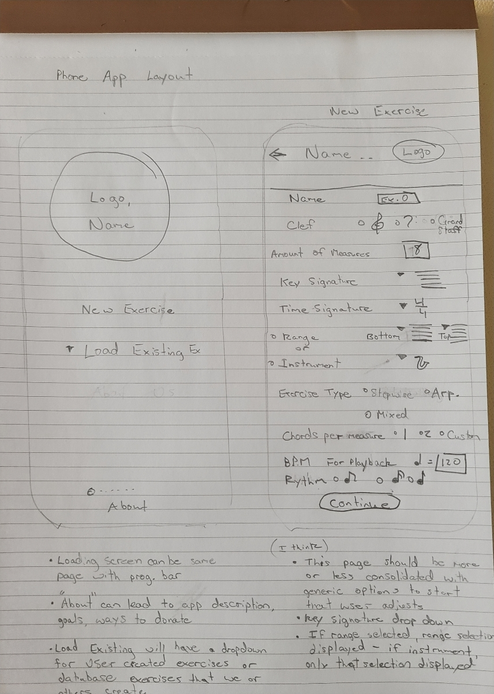
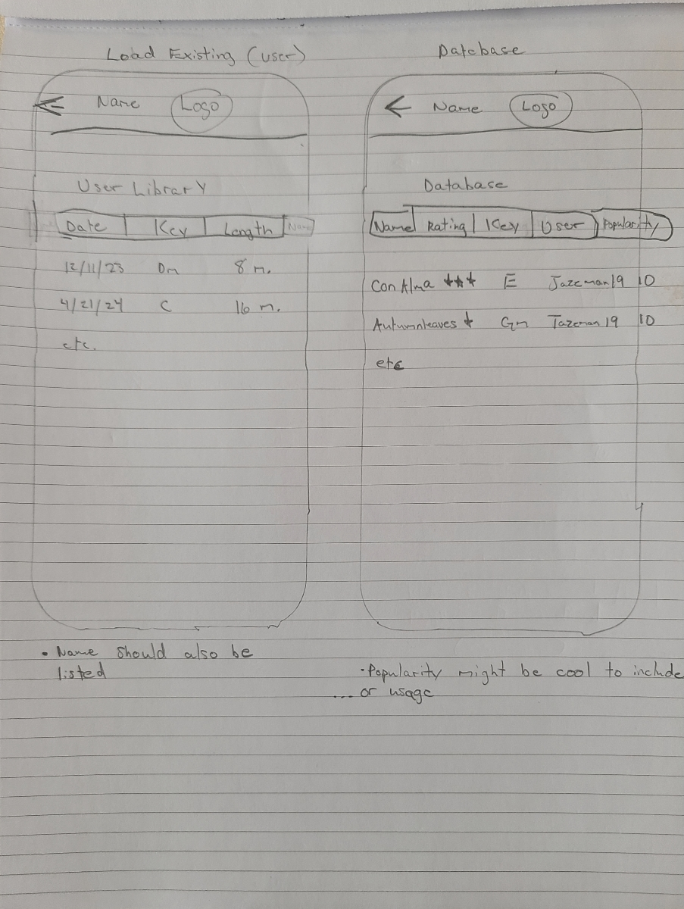
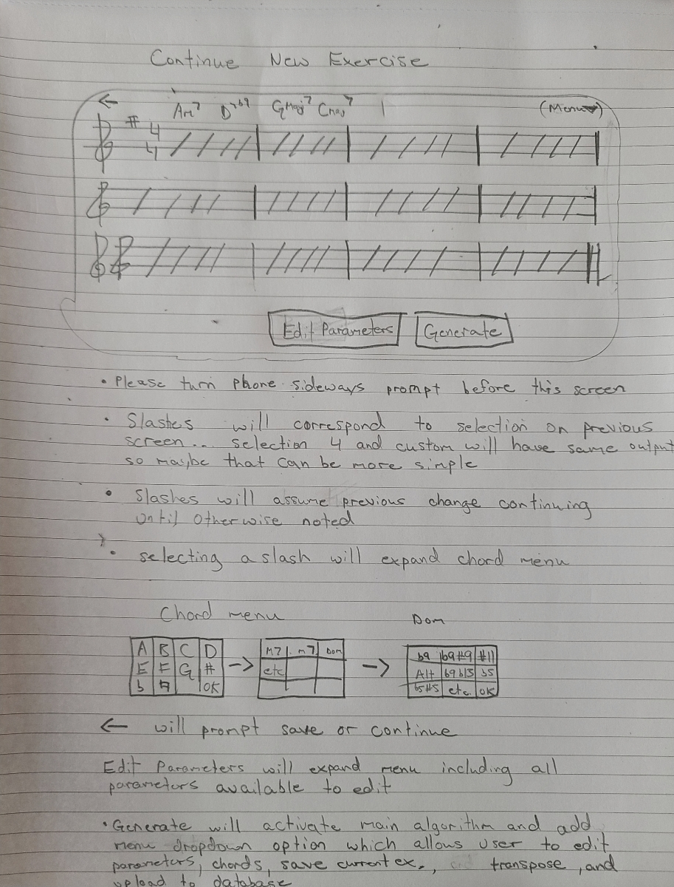

# ChordCaptain

## Table of Contents

1. [Design specification](#design-specification)
2. [Developer information](#developer-information)

## Design specification

### 1.0 Goals

* Software will allow changes to be made to input chord progressions
* Software will allow for certain notes to be disabled
* Software will impose harmonic extensions (basic)
* Software will employ good voice-leading techniques
* Software will provide exercises for chord progressions such as: root position arpeggios for each chord; arpeggios with varying directions for each chord that use proper voice leading from chord to chord; completely stepwise and uni-directional lines which employ good voice leading and change direction only at specified ranges
* Software will have customizable preset ranges for different instruments such as tenor saxophone and trombone
* Software will be able to transpose inputs or outputs
* Software will be able to generate images of output material to be exported.
* Software will have capability to save/load chord progressions/ exercises

### Primary Objective

Develop an algorithm which will output/transcribe harmonically sound melodic material given a defined chord progression over a defined amount of measures.

### Secondary Objectives

* Software will give an analysis for the end-user to use to study the algorithm's strategies for developing lines
* Software will use idiomatic phrasing in the jazz genre
* Software will be able to use ireal pro images to generate chord progression input
* Software will be able to provide an analysis for pre-existing transcriptions
* Software will be able to impose chords in specified areas of familiar chord progressions
* Software will have different degrees of complexity in outputs, ranging from low volumes of implied harmonies to high volumes
* Software will have different degrees of rhythmic variety (late stage)
* Software will be able to learn transcriptions and translate phrases into vocabulary with sophisticated analysis of harmony, melody, and rhythmic phrasing
* Software will allow changes to be made to input chord progressions
* Software will allow for certain notes to be disabled in contexts
* Software will impose harmonic extensions
* Software will employ good voice-leading techniques
* Software will provide exercises for chord progessions such as: root position arpeggios for each chord; arpeggios with varying directions for each chord that use
* proper voice leading from chord to chord; completely stepwise and uni-directional lines which employ good voice leading and change direction only at specified ranges
* Software will have customizable preset ranges for different instruments such as tenor saxophone and trombone
* Software will be able to transpose inputs or outputs
* Software will be able to generate images of output material to be exported.
* Software will have capability to save/load chord progressions and output material to device of use.
* Software will be able to recognize relationships between chords and target chords and choose from a variety of possible outputs depending on previously used material in the same solo
* Software will be able to assign weight to certain "devices" in line generation- device being defined as a recognizable motif or harmonic approach- so that the end-user can isolate/study that device. A finite set of devices will be pre-defined
* Users will be able to create custom devices

### Example images





## Developer information

### Recommended IDE Setup

[VSCode](https://code.visualstudio.com/) + [Volar](https://marketplace.visualstudio.com/items?itemName=Vue.volar) (and disable Vetur) + [TypeScript Vue Plugin (Volar)](https://marketplace.visualstudio.com/items?itemName=Vue.vscode-typescript-vue-plugin).

### Type Support for `.vue` Imports in TS

TypeScript cannot handle type information for `.vue` imports by default, so we replace the `tsc` CLI with `vue-tsc` for type checking. In editors, we need [TypeScript Vue Plugin (Volar)](https://marketplace.visualstudio.com/items?itemName=Vue.vscode-typescript-vue-plugin) to make the TypeScript language service aware of `.vue` types.

If the standalone TypeScript plugin doesn't feel fast enough to you, Volar has also implemented a [Take Over Mode](https://github.com/johnsoncodehk/volar/discussions/471#discussioncomment-1361669) that is more performant. You can enable it by the following steps:

1. Disable the built-in TypeScript Extension
    1) Run `Extensions: Show Built-in Extensions` from VSCode's command palette
    2) Find `TypeScript and JavaScript Language Features`, right click and select `Disable (Workspace)`
2. Reload the VSCode window by running `Developer: Reload Window` from the command palette.

### Customize configuration

See [Vite Configuration Reference](https://vitejs.dev/config/).

### Project Setup

```sh
npm install
```

#### Compile and Hot-Reload for Development

```sh
npm run dev
```

#### Type-Check, Compile and Minify for Production

```sh
npm run build
```

#### Run Unit Tests with [Vitest](https://vitest.dev/)

```sh
npm run test:unit
```

#### Run End-to-End Tests with [Cypress](https://www.cypress.io/)

```sh
npm run test:e2e:dev
```

This runs the end-to-end tests against the Vite development server.
It is much faster than the production build.

But it's still recommended to test the production build with `test:e2e` before deploying (e.g. in CI environments):

```sh
npm run build
npm run test:e2e
```

#### Lint with [ESLint](https://eslint.org/)

```sh
npm run lint
```